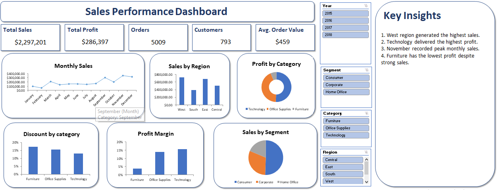

# 📊 Sales Performance Dashboard

## Project Overview

This project analyzes retail sales data using Microsoft Excel. The dashboard provides insights into sales, profit, customer behavior, and regional performance through interactive visualizations.

## Tools Used

- MS Excel
- Pivot Tables
- Pivot Charts
- Excel Tables
- Slicers
- Git & GitHub

## Dataset

- Sample Superstore Dataset
- 9,994 Records
- 21 Columns

## Dashboard Features

- Executive KPI Cards
- Monthly Sales Trend
- Sales by Region
- Profit by Category
- Interactive Filters

## Key Insights

- West region generated the highest sales.
- Technology produced the highest profit.
- November recorded the highest monthly sales.
- Furniture generated lower profits despite strong sales.

## Skills Demonstrated

- Data Cleaning
- Data Validation
- Exploratory Data Analysis
- Dashboard Design
- Business Storytelling

## Dashboard Preview

